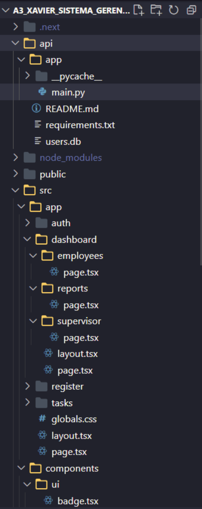

## 👥 Equipe

| Nome Completo                  | Matrícula   |
| ------------------------------ | ----------- |
| Gustavo Gantois Caria Carvalho | 1272325306  |
| Caique Luan Oliveira Silva     | 12725136785 |
| José Felipe Amorim Gerez       | 12725158186 |

---

## 🧾 Descrição Geral do Projeto

O **Sistema de Ordem e Gerenciamento** é uma aplicação cliente-servidor desenvolvida para controlar tarefas e ordens de serviço dentro de uma empresa. Ele permite o acompanhamento eficiente de demandas internas por meio de três perfis distintos de usuário:

* **Funcionário**: recebe e conclui tarefas atribuídas.
* **Supervisor**: cadastra e monitora tarefas.
* **Gerente**: acessa relatórios estratégicos sobre a execução das tarefas.

O sistema foi construído com tecnologias modernas que garantem facilidade de uso, modularidade, escalabilidade e visual agradável.

---

## 🚀 Tecnologias Utilizadas

### 🔧 Back-End

* **Linguagem:** Python 3.9+
* **Framework:** FastAPI
* **Banco de Dados:** SQLite (ambiente de desenvolvimento local)
* **ORM:** SQLAlchemy
* **Validação:** Pydantic
* **Servidor:** Uvicorn

### 🎨 Front-End (Next.js)

* **[Next.js](https://nextjs.org/)** – Framework React para aplicações web otimizadas
* **[TypeScript](https://www.typescriptlang.org/)** – Linguagem com tipagem estática
* **[shadcn/ui](https://ui.shadcn.com/)** – Componentes UI modernos e personalizáveis
* **[Tailwind CSS](https://tailwindcss.com/)** – Utilitário de classes para estilização rápida e responsiva
* **[React Hook Form](https://react-hook-form.com/)** – Gerenciamento de formulários em React
* **[Zod](https://zod.dev/)** – Validação de schemas no front-end integrada ao React Hook Form
* **[Axios](https://axios-http.com/)** – Cliente HTTP para comunicação com o back-end
* **Pages Router** do Next.js – Navegação entre páginas baseada em arquivos

---

## 📁 Estrutura do Projeto



---

## ⚙ Requisitos de Execução

* Python 3.9 ou superior
* Node.js 18 ou superior
* Navegador moderno (Chrome, Firefox, Edge)

---

## 🛠 Como Instalar e Executar o Sistema

### 🔙 Back-End (API FastAPI)

1. Navegue até a pasta do back-end:

   ```bash
   cd api
   ```

2. Crie e ative um ambiente virtual (recomendado):

   ```bash
   python -m venv venv
   source venv/bin/activate  # Linux/Mac
   venv\Scripts\activate     # Windows
   ```

3. Instale as dependências:

   ```bash
   pip install fastapi uvicorn sqlalchemy pydantic
   ```

4. Inicie o servidor:

   ```bash
   uvicorn main:app --reload
   ```

5. Acesse a API:
   [http://localhost:8000](http://localhost:8000)

### 🔜 Front-End (Next.js + TypeScript)

1. Instale os pacotes:

   ```bash
   npm install
   ```

2. Compile e execute a aplicação:

   ```bash
   npm run build
   npm run dev
   ```

4. Acesse a interface web:
   [http://localhost:3000](http://localhost:3000)

---

## 💡 Justificativa da Arquitetura de Comunicação

Utilizamos uma arquitetura baseada em API RESTful com FastAPI (back-end) e Axios (front-end), com os seguintes benefícios:

* Simplicidade e clareza no fluxo de comunicação
* Facilidade de expansão com novas rotas e funcionalidades
* Separação de responsabilidades entre lógica de negócios e interface
* Padrão amplamente adotado em sistemas web modernos
* Integração com bibliotecas modernas (React Hook Form, Zod, Tailwind)

---

## 📌 Funcionalidades por Perfil

### 🧑 Funcionário

* Cadastro/login
* Acesso ao dashboard pessoal
* Visualização de tarefas alocadas
* Marcar tarefas como concluídas
* Feedback de confirmação ou erro

### 🧑‍🔧 Supervisor

* Cadastro/login
* Cadastro de novas tarefas
* Atribuição de tarefas para funcionários
* Consulta de tarefas pendentes/concluídas
* Feedback de status de operação

### 👨‍💼 Gerente

* Cadastro/login
* Acesso a relatórios estratégicos:

  * ✅ Tarefas cadastradas
  * ✅ Tarefas pendentes
  * ✅ Funcionários sem tarefas pendentes

---

## 🧪 Exemplos de Uso

### Funcionário

1. Cadastra conta e faz login
2. Acessa área de tarefas
3. Visualiza ordens atribuídas
4. Marca como concluídas
5. Recebe retorno do sistema

### Supervisor

1. Faz login
2. Cria nova tarefa e atribui a funcionário
3. Consulta tarefas ativas/finalizadas
4. Visualiza retorno do sistema

### Gerente

1. Acessa painel administrativo
2. Filtra e consulta relatórios
3. Visualiza estatísticas e progresso

---

## 🧾 Requisitos Atendidos do Enunciado

| Requisito                                                           | Status |
| ------------------------------------------------------------------- | ------ |
| Back-End com FastAPI (Python)                                       | ✅      |
| Banco relacional (SQLite)                                           | ✅      |
| Front-End com Next.js (React)                                       | ✅      |
| Três perfis de usuário distintos (funcionário, supervisor, gerente) | ✅      |
| Interface com acesso e permissões separadas                         | ✅      |
| Ações de CRUD e status de ordens                                    | ✅      |
| Geração de 3 tipos de relatório por gerente                         | ✅      |
| Comunicação entre cliente e servidor via API                        | ✅      |
| README com documentação detalhada                                   | ✅      |
| Vídeo de apresentação (em andamento)                                | 🔜     |

---

## 🎥 Vídeo de Apresentação

🔗 Link para o vídeo no YouTube: *(inserir aqui)*

* Duração: entre 5 e 10 minutos
* Apresentação feita por: Integrantes da equipe
* Conteúdo: Demonstração de uso, estrutura, tecnologias e justificativas

---

## 📄 Licença

Este projeto está licenciado sob os termos da **MIT License**.

---

## 📬 Contato

Em caso de dúvidas, entre em contato com qualquer membro da equipe ou abra uma *issue* no [GitHub](https://github.com/DevGustavoGantois/A3_Xavier_sistema_gerenciamento).

---

## ✅ Conclusão

O sistema entregue cumpre todos os requisitos estabelecidos na proposta da A3 e demonstra a aplicação prática de conceitos de sistemas distribuídos, desenvolvimento web moderno, segregação de papéis e uso eficiente de tecnologias como **FastAPI**, **Next.js**, **SQLAlchemy**, **TypeScript** e **Tailwind CSS**.
